# Fibaro-Home-Automation
This repo is dedicated to the Fibaro system including ACS experience in configuration, commissioning, integration, and troubleshooting. 
## 📚 __Table of contents__

- [Introduction to FIBARO](#1-introduction-to-fibaro-)
  

  
Home Center 2

     - [Installation](#installation)
     - [Lanch and Interface](#lanuch-and-interface)
     - [Main Screen](#main-screen)         
       
  

  

  
Devices

     - [Adding Z-Wave devices](#adding-z-wave-devices)
     - [Delete Devices](#delete-devices)
     - [Virtual Devices](#virtual-devices)
     
  
       
  

  
Scenes

     - [Adding Scene](#adding-scene)  
     
   
     

     
Consumption

     - [Energy Panel](#energy-panel)
     - [Temperature Panel](#temperature-panel)

       

     - [Plugins](#plugins)
     - [Panels](#panels) 
       
      
       
Configuration

       - [General Information](#general-information)
       - [Access Control](#access-control)
       - [Backup & Recovery](#backup--recovery)
       - [Diagnostics](#diagnostics)
       - [Gateway connections](#gateway-connections)
       - [LAN Settings](#lan-settings)
       - [Location](#location)
       - [Notification Center](#notification-center)
       - [Wizard HC](#wizard-hc)
       - [Z-Wave network](#z-wave-network)
       - [Notes on FIBARO](#notes-on-fibaro)
       
       

       

       
Home Center Lite

       - [Installation HCL](#installation-hcl)      
       

* [Fibaro Sensors](#-fibaro-sensors)  
   
   

   
   
Motion Sensor

      
     - [MS_Installation](#ms_installation-ms)
         - [MS_Basic Activation](#ms_basic-activation)
         - [MS_Adding to network](#ms_adding-to-the-network)
         - [MS_Wake Up](#ms_wake-up)
         - [MS_Resetting Sensor](#ms_resetting-sensor)
     - [MS_Configuration](#ms_configuration)
         - [MS_Associations](#ms_associations)
         - [MS_Advanced Parameters](#-ms_advanced-prameters-)

     

     
     

     
Flood Sensor

       
     - [FS_Installation](#fs_installation)
         - [FS_Adding to network](#fs_adding-to-the-network)
         - [FS_Resetting Sensor](#fs_resetting-sensor)
     - [FS_Configuration](#fs_configuration)
         - [FS_Associations](#fs_associations)
         - [FS_Advanced Parameters](#-fs_advanced-prameters-)

     

     

     
Smoke Sensor

     
     - [SS_Installation](#ss_installation)
         - [SS_Adding to network](#ss_adding-to-the-network)
         - [SS_Resetting Sensor](#ss_resetting-sensor)
     - [SS_Configuration](#ss_configuration)
         - [SS_Associations](#ss_associations)
         - [SS_Advanced Parameters](#-ss_advanced-prameters-)
         
     

     
     

     
Co Sensor

     - [COS_Installation](#cos_installation)
         - [COS_Basic Activation](#cos_basic-activation)
         - [COS_Physical Installation](#cos_physical-installation)
         - [COS_Adding to network](#cos_adding-to-the-network)
         - [COS_Resetting Sensor](#cos_resetting-the-device-to-factory-defaults)
     - [COS_Configuration](#cos_configuration)
         - [COS_Associations](#cos_associations)
         - [COS_Advanced Parameters](#-cos_advanced-prameters-)

     

     
- [Fibaro Switches](#fibaro-switches) 
   

   
Single/Double Switch

     
     - [SDSW_Installation](#sdsw_installation)
         - [SDSW_Adding to network](#sdsw_adding-to-the-network)
         - [SDSW_Resetting Switch](#sdsw_resetting-switch)
         - [SDSW_Activating Scenes](#sdsw_activating-scenes)
         - [SDSW_Power and energy consumption](#sdsw_power-and-energy-consumption)
     - [SDSW_Configuration](#sdsw_configuration)
          - [SDSW_Associations](#sdsw_associations)
          - [SDSW_Advanced Parameters](#-sdsw_advanced-prameters-)

     

     

     
Dimmer 2

     
     - [Dim_Installation](#dim_installation)
          - [Dim_Adding to network](#dim_adding-to-the-network)
          - [Dim_Calibration](#dim_calibration)
          - [Dim_Resetting](#dim_resetting-dimmer-2)
          - [Dim_Software update](#dim_software-update)
          - [Dim_Error modes](#dim_error-modes)
     - [Dim_Configuration](#dim_configuration)
          - [Dim_Associations](#dim_associations)
          - [Dim_Advanced Parameters](#-dim_advanced-prameters-)
          - [Dim_Troubleshooting](#dim_troubleshooting-️️)
     
     

### 📝1. __Introduction to FIBARO__
 
   There are different types of hubs can be used with Fibaro system such as Home Center2, Home Center Lite, Home center 3 and so on. We focused on two main types Home Center2 and Home Center Lite as a main hubs used. And these hubs described as following:

  #### 
__Home Center__ 2

  ##### 
__📦Installation__

  

  
  
  
  

  

    To access to the HC@ login panel, you should firstly, install the Fibaro Finder program to get the HC2 IP then login in from the browser OR install IP Scanner program to also get the IP of the HC2.
   
  ##### 
__Lanuch and Interface__

  

    1. After the connection you will access to HC2 login panel.
    2. Enter login and password ->Default are admin/admin.
    3. You can operate your Home Automation System.

##### __Main Screen__

 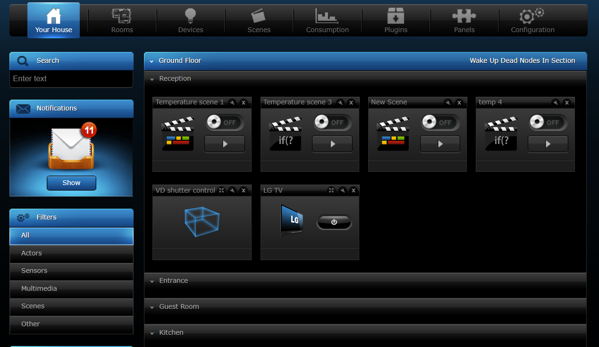
 
 The main home screen contains 8 panels:

    1.Top bar –> shows current status of devices
    2.Command window –> displays a list of actions performed by the main controller
    3.Menu –> the main navigation bar
    4.Search tool –> find the device
    5.Filters –> sidebar menu to see only a specified type of components
    6.The House –> sidebar menu to select the specified room or section
    7.Main section –> list of devices grouped into sections and rooms
    8.Right sidebar –> easy access to core functions of the system

##### __Devices__

###### __Adding Z-Wave devices__

    Z-Wave is a wireless communication protocol designed primarily for home automation and smart home devices. Developed to operate on a low-power, sub-gigahertz frequency band, Z-Wave ensures robust, reliable, and energy-efficient communication between a wide variety of smart devices, including lighting, heating, and security systems.

  
  

    Tip: __Before adding a new device, you should delete it first then add it again__.

###### __Delete Devices__

    Deleting the device will remove it from the Z-Wave network and from the controller’s memory. The device will be restored to its default settings during this process.

###### __Virtual Devices__

Virtual devices are designed to control complex devices such as air conditioning units and home appliances via local remote (LAN network). The Fibaro System makes it possible to import existing or create new virtual devices to be controlled by the Home Center interface.

     Importing virtual devices:
     1. Go to devices section and open it.
     2. Add or Remove device
     3. Use import virtual device panel.
     4. Fill in the IP address and TCP port and usually be 80.

##### __Scenes__

Scenes can integrate multiple devices included in your system. Scenes may be initiated by weather condition, a series of intuitive timers or various sensor/module state.

###### __Adding Scene__

     There are three ways to create a scene in HC2 interface:
     
     1.Magic Scenes –> based on one trigger, one action scheme (if trigger appears, then action occurs).
     2.Block Scenes -> are more powerful than magic scenes and still easy to build. 
     3.LUA Scenes -> are most advanced scenes, which are based on the Lua programming language and require basic programming skills.

  
  
  
  

##### __Consumption__

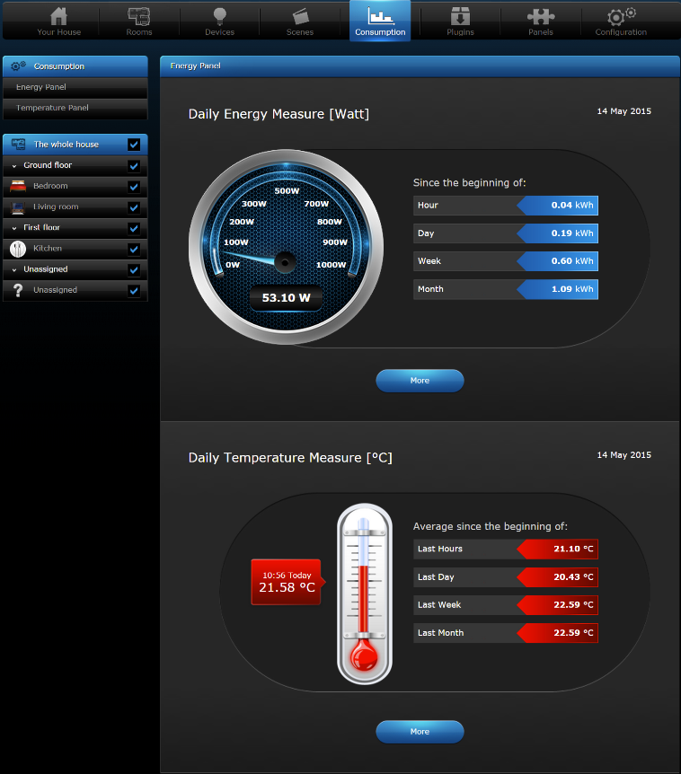
 
###### __Energy Panel__

     Energy panel shows complex information about current and statistical electric energy consumption.

###### __Temperature panel__

     Temperature panel shows complex information about current and statistical temperature.

##### __Plugins__

 Plugins allow users to customize and extend the capabilities of their HC2 system by integrating additional features, devices, and services.

 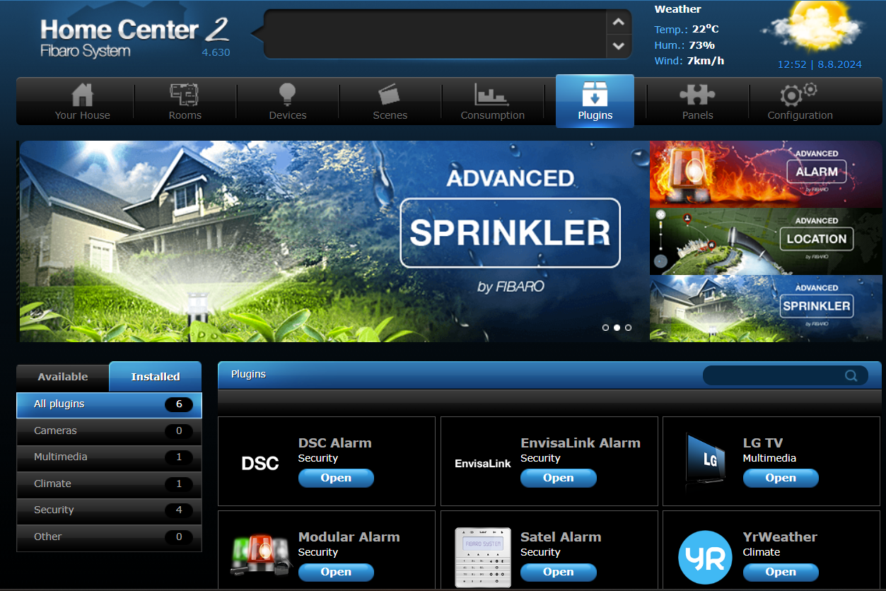

##### __Panels__

     SMS Panel -> lets you manage your house via text messages when you have no internet access.

     Alarm Panel -> gives the opportunity to create an alarm with the Z-Wave sensors we already have installed in our home.

     Heating Panel -> allows you to schedule heating programs at predetermined times.

     AC Panel -> allows you to schedule cooling programs at predetermined times. After the zones have been created and rooms are added to it, all linked devices responsible for maintaining the desired temperature will work in accordance with schedule.

     Humidity Panel -> allows you to schedule humifying programs at predetermined times.

     Sprinklers Panel -> is designed to control sprinkler Relay Switches modules. It allows you to create sprinkling schedule or control sprinklers manually.

     Events Panel -> is a register of all of the activities taking place in a FIBARO System. The panel lets the user monitor changes in status of all devices and filter them depending on the device type, location or the time of occuring.

     Variables Panel -> allows you to add, change and check status of global variables that can be used in your scenes.

     Notifications Panel -> gives the ability to create messages to be used for informing the user of certain events taking place in the house.

     Localization Panel -> uses user defined GPS points to activate GPS scenes. There are two ways of defining GPS points: choosing on a map, or entering certain GPS coordinates.

     Linked Devices -> combine several devices into one device. Using this function results in controlling the group of related devices as if they were one single device. 

     VoIP panel -> allows to add and configure VoIP clients.

##### __🔧Configuration__

###### __General Information__

###### __Access Control__

###### __Backup & Recovery__

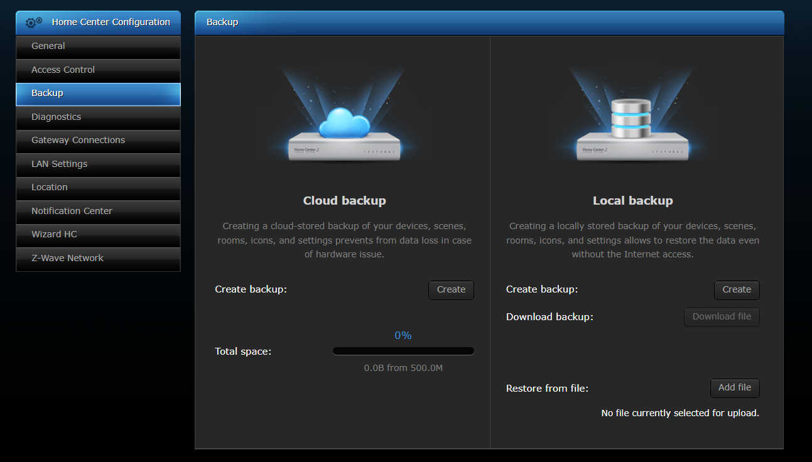

###### __Diagnostics__
     
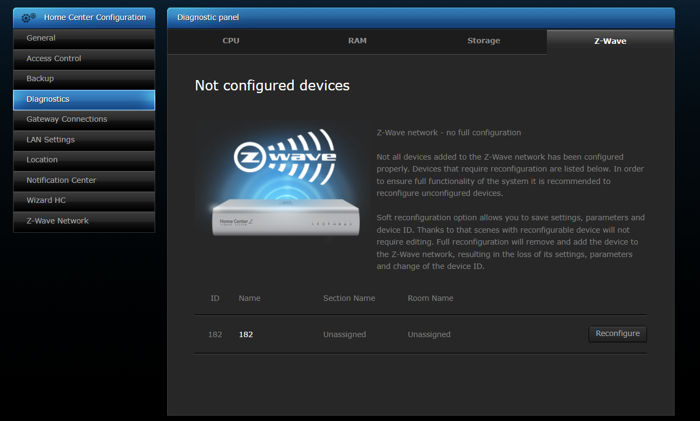

###### __Gateway connections__

     

###### __LAN Settings__

###### __Location__

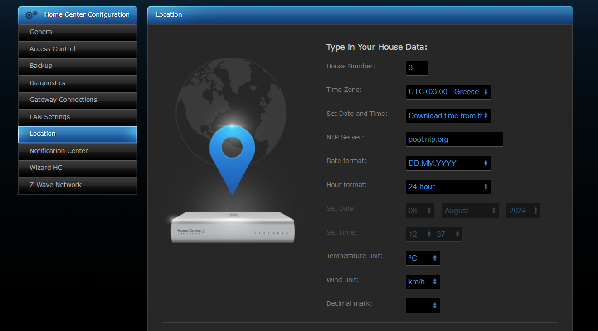

###### __Notification Center__

###### __Wizard HC__

###### __Z-Wave network__

  
 
 ### __Notes on FIBARO__ 

- Troubleshooting: Checking list

      1. You must check if the FIBARO Home Center is connected to FIBARO ID account.
      2. Check if your FIBARO Home Center is connected to another FIBARO ID account.
      3.Internet is not on, what to do?
       -It may be due to the fact that your Home Center has static IP. The controller in this state has the following parameters: -Default settings for static IP
                   -IP Address: 192.168.81.1
                   -Subnet Mask: 255.255.255.0
                   -Gateway Address: 192.168.81.1
      4.How to change the HC IP address to static or dynamic (DHCP)?
                   -Go to the Configuration tab.
                   -Choose LAN Settings from the left sidebar.
                   -Check your IP address, enter it to your Internet browser.
                   -Check your IP address, enter it to your Internet browser.
                   -Look for DHCP Settings and find Address Reservation setting. Add a new address reservation by entering MAC Address of your Home Center. 
                   -Perform the restart of the router and wait about two minutes until the router starts again.
                   -Go to the DHCP Settings and find Address Reservation again
                   -Go to the Home Center -> Configuration tab -> LAN Settings and change the connection type to static IP and enter the IP address added on the router.
                   -Save changes by clicking floppy disc icon on the right sidebar.

#### 
__Home Center Lite__

##### 
__📦Installation HCL__

  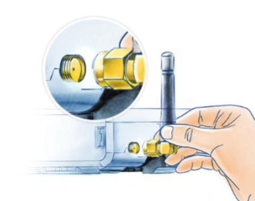
  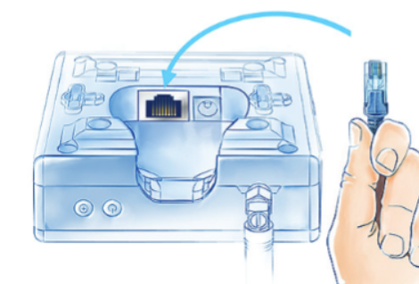
  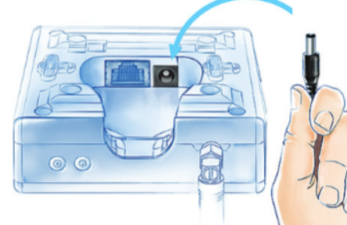
  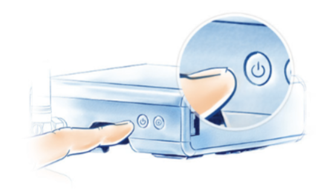

### __📡 Fibaro Sensors__

#### __🕵️ Motion Sensor__

##### 
__📦MS_Installation MS__

###### __MS_Basic Activation__

  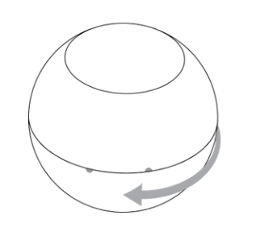
  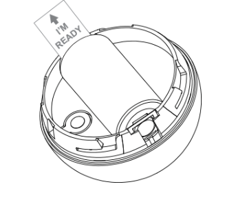
  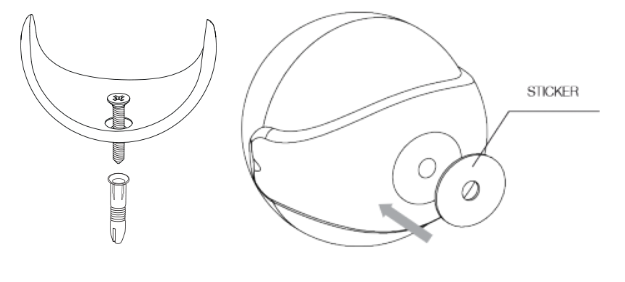

     ⚠️Attention! The hanging height of the product should be less than 2m and width less than 7m.

###### __MS_Adding to the network__

     ⚠️Before adding the sensor, prefer to rest it firstly.
     1.Open the cover.
     2.Make sure the device is powered.
     3.Place the Motion Sensor within the direct range of your Z-Wave controller.
     4.Log into Home Center configuration interface.
     5.In Devices section click Add or remove device.
     6.Click Add to start adding mode.
     7.Quickly, three times press the B-button – LED diode will glow blue to confirm setting into learning mode.
     8.Wait for the adding process to end.
     9.If necessary, wake up the Motion Sensor by triple clicking the B-button.

###### __MS_Wake Up__

     To wake up the sensor manually triple click the B-button located inside the housing.

###### __🔄MS_Resetting Sensor__

Reset procedure erases memory of the device, including all information on the Z-Wave network and the main controller.

     1. Make sure the Sensor is powered.
     2. Press and hold the B-button.
     3. Wait for 4-6 seconds for the visual LED indicator to glow yellow.
     4. Release the B-button.
     5. Click the B-button, once.
     6. Successful reset will be confirmed with the visual indicator changing colour to red and fading.

###### __🔧MS_Configuration__

###### __MS_Associations__

     Association (linking devices) – direct control of other devices within the Z-Wave system network e.g. Dimmer, Relay Switch, Roller Shutter or scene (may be controlled only through a Z-Wave controller).

To add an association (using the Home Center controller):

     1.Go to Settings. 
     2.Go to Devices.
     3.Select the appropriate device from the list.
     4.Select the Associations tab.
     5.Define to which group and which devices to associate.
     6.Save the changes.
     7.Wake up the device manually or wait for the next automatic wake up.

FIBARO Motion Sensor provides the association of five groups:

- 1st Association Group –> Lifeline -> Allow for assigning single device only(main controller).
- 2nd Association Group –> Motion -> Sends motion detection and alarm cancellation frames to the associated devices.
- 3rd Association Group –> Tamper -> Sends tamper alarm and alarm cancellation frames to the associated devices.
- 4th Association Group –> Motion BC -> 3rd + Provides backward compatibility with controllers not supporting Z-Wave+
- 5th Association Group –> Tamper BC -> 3rd + Provides backward compatibility with controllers not supporting Z-Wave+ protocol.

     ⚠️ The Motion Sensor in 2nd to 5th group allows to control 5 regular and 5 multichannel devices per an association group.

     ⚠️ It is not recommended to associate more than 10 devices in general, as the response time to control commands depends on the number of associated devices. 

###### __📊 MS_Advanced Prameters__ 🚨 

     ⚠️ Wake up interval -> software
        -Available settings: 1-65535 (in seconds, 1s – 24h).
        -Default setting: 7200 (every 2 hours).
      1.Sensitivity -> The lower the value, the more sensitive the PIR sensor is.
        -Available settings: 8-255
        -Default setting: 15
      2.Blind Time -> PIR sensor is insensitive to motion after last detection for the amount of time specified in this parameter.
        -Available settings: 0-15
        -Default setting: 15 (8 seconds)
        -Formula to calculate the time: time [s] = 0.5 x (value + 1)
      6. Alarm Cancelation Delay -> Time period after which the motion alarm will be cancelled in the main controller and associated devices.
        -Available settings: 1-32767
        -Default setting: 30 (30 seconds)
      8. Operating mode -> This parameter determines in which part of day the PIR sensor will be active. This parameter influences only the motion reports and associations.
        - 0 – PIR sensor always active
        - 1 – PIR sensor active during the day only
        - 2 – PIR sensor active during the night only
        - Default setting: 0
      9. Night/Day -> This parameter defines the difference between night and day in terms of light intensity, used in parameter 8
        - Available settings: 1-32767
        - Default setting: 200 (200 lux)
      
- Troubleshooting: Checking list

     ⚠️MS does not report any values/ can not add it to system/ breached the whole time: 
     - Check if your FIBARO Motion Sensor is properly powered.
     - Delete and add your device to the system again.
     - Soft reconfiguration -> Go to Devices => Settings => Advanced => Soft Reconfiguration.
     - Set lifeline group associations.
   
   ⚠️MS runs off of battery quickly:

     - Reducing the sensitivity to movement.
     - Reducing the frequency of reports of temperature or lux.
     - Check the direction of work of your sensor – it is possible that it scans the movement from the outside.
     - Check if your device was mounted with accordance of device’s instruction.

 
#### __🌊Flood Sensor__

##### 
__📦FS_Installation__

 

  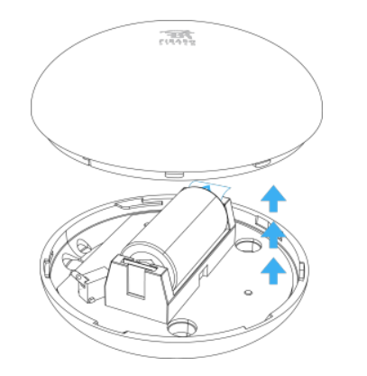
  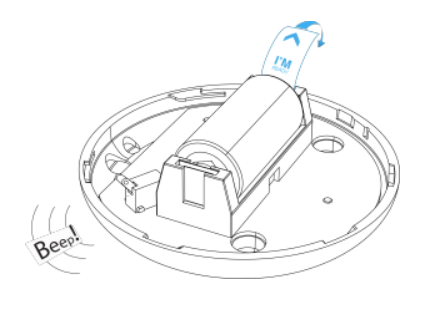
  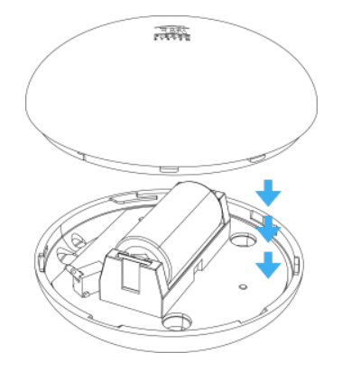

###### __FS_Adding to the network__
 
     1.Open the cover.
     2.Place the Flood Sensor within the direct range of your 3.Z-Wave controller.
     4.Log into Home Center configuration interface.
     5.In Devices section click Add or remove device.
     6.Click Add to start adding mode.
     7.Quickly, three times press the TMP button.

In case the Sensor is not added, please reset the Sensor and repeat the adding procedure.
Adding in security mode must be performed up to 2 meters from the controller.

###### __🔄FS_Resetting Sensor__

- Resetting the device is not the recommended way of removing the device from the Z-Wave network. Use reset procedure only if the primary controller is missing or inoperable. Certain device removal can be achieved by the procedure of removing.

     1. Make sure the Sensor is powered.
     2. Press and hold the TMP button.
     3. Wait 15-20 seconds for the visual LED indicator to glow yellow (4th position of the MENU).
     4. Release the TMP button.
     5. Click the TMP button once to confirm selection.
     6. Successful reset will be confirmed with the visual indicator changing colour to red and acoustic signal.

###### __🔧FS_Configuration__

###### __FS_Associations__

     Firmware 3.2 or higher:
     1.1st Association Group ->allows for assigning single device only.
     2.2nd Association Group ->devices in this group will be switched on or off when flood status changes.
     3.3rd Association Group ->devices in this group will receive notification about flood detection or cancellation. 
     4.4th Association Group ->devices in this group will receive a notification when the sensor is moved or the cover is taken off (which normally holds the button).

     Firmware 2.6 or lower:
     1.1st Association Group ->sending the BASIC SET (default) or ALARM control frame to the associated devices.
     2.2nd Association Group ->ALARM GENERIC control frame will be sent to the associated devices.
     3.3rd Association Group ->allows for assigning single device only.

###### __📊 FS_Advanced Prameters__ 🚨 
 
   ⚠️ Wake up interval (battery mode)
       
       Firmware 3.2 or higher:

       Available settings: 0 or 60-86400 (in seconds, 1min – 24h)
       Default setting: 21 600 (every 6 hours)

      1. Alarm Cancellation Delay ->Delays flood alarm cancelation for the device after flooding has ceased.
         - Available settings: 0 – 3 600 (in seconds, each 1s).
         - Default setting: 0 (no delay, immediate alarm cancelation).

      Firmware 2.6 or lower:
      
      Available settings: 0 or 5-86399 (in seconds, 5s – 24h)
      Default setting: 4 000 (every 66 minutes)

#### __🔥Smoke Sensor__

##### 
__📦SS_Installation__

     1. Turn the cover counter-clockwise and open it.
     2. Remove the battery blocker.
     3. Screw the FIBARO Smoke Sensor into the cover.
     4. Add the device (see “Adding to the network”).
     
##### __Installation Notes__

     Install the sensor at least 1.5m from air conditioners.
     Do not install the sensor in direct sunlight. Keep at least 0.5m distance from light sources.
     It is recommended to install the sensor in every room except kitchens and bathrooms.
     In standard corridors (up to 3 m) it is recommended to use smoke detectors every 15 m maximum. If the corridor is L or U-shaped, installation in the middle of the corners is recommended.

###### __SS_Adding to the network__

     1. Make sure the device is supplied.
     2. Place the Smoke Sensor within the direct range of your Z-Wave controller.
     3. Log into Home Center configuration interface.
     4. In Devices section click Add or remove device.
     5. Click Add to start adding mode.
     6. Quickly, three times press the B-button.
     7. Quickly, three times press the B-button.

⚠️ In case the Sensor is not added, please reset the Sensor and repeat the adding procedure.

###### __🔄SS_Resetting Sensor__

     1. Press and hold the B-button.
     2. Wait for the visual indicator to glow white and short acoustic signal to sound.
     3. Release the B-button.
     4. Wait for the visual indicator to glow yellow.
     5. Press the B-button again, briefly.
     

###### __🔧SS_Configuration__

###### __SS_Associations__

- 1st Association Group ->Only one device – Z-Wave network controller may be set in this group. It’s not recommended to modify this association group.
- 2nd Association Group ->Sending the BASIC SET control command once smoke is detected.
- 3rd Association Group ->Sending the notification NOTIFICATION REPORT (TYPE = BURGLAR, EVENT = PRODUCT COVERING REMOVED) to associated devices once enclosure opening is detected.
- 4th Association Group ->Sending the notification ALARM SENSOR REPORT (TYPE = SMOKE ALARM) to associated devices once smoke is detected.
- 5th Association Group ->Sending ALARM SENSOR REPORT notification (TYPE = GENERAL) to associated devices once enclosure opening is detected.

###### __📊 SS_Advanced Prameters__ 🚨 

   ⚠️ Wake up interval 
     
     - Available settings: 0 or 21 600 – 65 535 (in seconds, 6h – 18h)
     - Default setting: 21 600 (6h)

   Setting to 0 disables sending Wake Up Notification frame. Wake up may be still performed manually by a single B-button click or by sending Node Info frame (triple click the B-button).

     1. Sensitivity ->There are 3 levels of sensitivity to smoke presence. Level 1 means the highest sensitivity. Rising the parameter value lowers the sensitivity to smoke presence.
       - High, Medium, and Low -> Medium recommended.
     32. Lack of Z-Wave range indication interval -> Time interval of signaling (visual indication/sound) lack of Z-Wave range.
       - Available settings: 1-8640 (multiply by 10 seconds) [10s-24h] 1-8640 – [10s-24h] Default setting: 180 (30min).

- Troubleshooting: Checking list
 
   - ⚠️ Alarm without smoke/ send sounds from time to time:
        
        - Check if your FIBARO Smoke Sensor works properly.
        - Check the parameters of the device ->Change the parameters 30, 31 and 32
        

#### __🛑CO Sensor __

##### 
__📦COS_Installation__

###### __COS_Basic Activation__

  
  
  
  

###### __COS_Physical installation__

  
  
  

###### __COS_Adding to the network__

     1. Place the device within direct range of the Z-Wave controller.
     2. Log into Home Center configuration interface.
     3. In Devices section click Add or remove device.
     4. Click Add to start adding mode.
     5. Quickly, triple click the button located on the casing.
     ⚠️ In case the Sensor is not added, please reset the Sensor and repeat the adding procedure.

###### __COS_Resetting the device to factory defaults__

Resetting the device is not the recommended way of removing the device from the Z-Wave network. Use reset procedure only if the primary controller is missing or inoperable. Certain device removal can be achieved by the procedure of removing.

     1. Press and hold the button.
     2. Release the button when LED indicator glows white and short beep sounds.
     3. Click the button when LED indicator glows yellow.
     4. After few seconds the device will be reset (confirmed by red LED indicator and long beep).

###### __🔧COS_Configuration__

###### __COS_Associations__

     1st Association Group -> Lifeline ->Only one device – Z-Wave network controller may be set.(not recommended)
     2nd Association Group – CO Alarm ->devices in this group will be switched on/off when CO Alarm status changes.
     3rd Association Group – CO Alarm ->devices in this group will receive notification when CO Alarm status changes. 
     4th Association Group – CO Level ->devices in this group will be switched on/off after exceeding the level of CO concentration specified in parameter 14.
     5th Association Group – Tamper Alarm ->sends tamper alarm and cancellation frames to the associated devices.
     6th Association Group – CO Alarm BC ->devices in this group will receive sensor alarm frames when CO Alarm status changes.
     7th Association Group – Tamper Alarm BC ->sends tamper alarm and alarm cancellation frames to the associated devices.

###### __📊 COS_Advanced Prameters__ 🚨 

⚠️ Wake up interval 

     Available settings: 0 or 3600 – 43200 (in seconds, 1h – 12h)
     Default setting: 21 600 (6h)

     2. Z-Wave notifications -> This parameter allows to set the actions which result in sending notifications to the Z-Wave network controller.
        - 0 – both actions disabled
        - 1 – tampering (opened casing)
        - 2 – exceeding the temperature
        - 3 – both actions enabled
        - Default setting: 0

     14. VCO level required for sending BASIC ON command to 4th association group -> This parameter defines the minimum level of CO concentration which exceeding will result in starting the timer set in parameter 15.
         - 25-400 – CO concentration level in ppm
         - Default setting: 40 (40 ppm)
         - ⚠️ Parameter 14 value must be at least 4 ppm higher than parameter 17 value.

     15. Time required for sending BASIC ON command to 4th association group -> This parameter defines the time during which the level of CO concentration should remain above the value set in parameter 14 to send the BASIC ON command to 4th association group.
          - 0 – immediate sensing of BASIC ON command
          - 1-2880 – (30s – 24h, in 30s steps)
          - Default setting: 0

      17. CO Level required for sending BASIC OFF command to 4th association group -> This parameter defines the level of CO concentration below which falling will result in sending the BASIC OFF command to 4th association group.
           - 10-400 – CO concentration level in ppm
           - Default setting: 25 (25 ppm)
           - ⚠️ Parameter 17 valuemust be at least 4 ppm lower than parameter 14 value.

### __⏯Fibaro Switches__

#### __Single/Double Switch 2__

##### __Supported loads__ ⚠️

Single Switch 2 (FGS-213) -> Resistive	->IEC(8A) ->UL(6.5A)
                          
Single Switch 2 (FGS-213) -> Incandescent ->IEC(8A) ->UL(5A)	
                         
Double Switch 2 (FGS-223) -> Resistive	->ICE(6.5A per channel, 10A overall) ->UL(6A per channel, 9.5A overall)

Double Switch 2 (FGS-223) -> Incandescent ->ICE(6.5A per channel, 10A overall) ->UL(6A per channel, 3A overall)	

##### 
__📦SDSW_Installation__

⚠️ Length of wires used to connect the control switch should not exceed 10m.

⚠️ The Switch 2 should be installed in a wall switch box compliant with a relevant national safety standards and with depth no less than 60mm,

     Notes for the diagrams:
     - S1 – terminal for 1st switch (has the function of activating the learning mode)
     - S2 – terminal for 2nd switch
     - L – terminal for live lead
     - Q/Q1 – output terminal of the 1st channel
     - Q2 – output terminal of the 2nd channel (only Double Switch 2)
     - N – terminal for neutral lead
     - B – service button (used to add/remove the device and navigate the menu)

  
  

###### __SDSW_Adding to the network__

     1. Place the Switch 2 within the direct range of your Z-Wave controller.
     2. Identify the S1 switch.
     3. Log into Home Center configuration interface.
     4. In Devices section click Add or remove device.
     5. Click Add to start adding mode.
     6. Quickly, three times press the S1 switch.
     7. Wait for the adding process to end.

Momentary switch:

After releasing the switch a spring automatically pushes back and disconnects the switch

Toggle switch:

Operates as a two-position switch, it has no spring that would set one position of the switch.

###### __🔄SDSW_Resetting Switch__

     1. Switch off the mains voltage (disable the fuse).
     2. Remove the Switch 2 from the wall switch box.
     3. Switch on the mains voltage.
     4. Press and hold the B-button to enter the menu.
     5. Wait for the visual LED indicator to glow yellow.
     6. Quickly release and click the B-button again.
     7. After few seconds the device will be restarted, which is signalled with the red LED indicator colour.

###### __SDSW_Activating scenes__

- The Switch 2 can activate scenes in the Z-Wave controller by sending scene ID and attribute of a specific action using Central Scene Command Class.
- By default scenes are not activated, set parameters 28 and 29 to enable scene activation for selected actions.

      Switch connected to S1,S2 terminal:
          
          - 1x click -> press 1 time
          - 2x click -> ....  2
          - 3x click -> .... 3
          - Hold -> held down
          - Release -> released

###### __🔧SDSW_Configuration__

###### __SDSW_Associations__

     1. 1st association group – “Lifeline” ->assigning single device only.
     2. 2nd association group – “On/Off (S1)” ->assigned to switch connected to the S1 terminal.(Basic class)
     3. 3rd association group – “Dimmer (S1)” ->assigned to switch connected to the S1 terminal.(multilevel class)
     4. 4th association group – “On/Off (S2)” ->assigned to switch connected to the S2 terminal.(Basic class)
     5. 5th association group – “Dimmer (S2)” ->assigned to switch connected to the S2 terminal.(multilevel class)
     

###### __📊 SDSW_Advanced Prameters__ 🚨 

     9. Restore state after power failure -> determines if the device will return to state prior to the power failure after power is restored.
          - 0 – the device does not save the state prior to the power failure and returns to „off” position.
          - 1 – the device restores its state prior to the power failure
          - Default setting: 1

     10. First channel - operating mode -> allows to choose operating for the 1st channel controlled by the S1 switch.
           - 0 –> standard operation
           - 1 –> delay ON
           - 2 –> delay OFF
           - 3 –> auto ON
           - 4 –> auto OFF
           - 5 –> flashing mode
           - Default setting: 0
           ⚠️ When parameter 10 value is set to 5, then parameter 11 value must be set to 0.
     
     11. First channel - reaction to switch for delay/auto ON/OFF modes:
           - 0 –> cancel mode and set target state
           - 1 –> no reaction to switch – mode runs until it ends
           - 2 –> reset timer – start counting from the beginning
           - 0 -> default

     12. First channel - time parameter for delay/auto ON/OFF modes:
          - 0 (0.1s), 1-32000 (1-32000s, 1s step) – time parameter
          - Default setting: 50 (50s)

     15. Second channel - operating mode (only Double Switch 2 - FGS-223) -> As 10 for S2

     16. Second channel - reaction to switch for delay/auto ON/OFF modes (only Double Switch 2 - FGS-223) -> As 10 for S2

     17. Second channel - time parameter for delay/auto ON/OFF modes (only Double Switch 2 - FGS-223) -> As 12 for S2

     40. Reaction to General Alarm ->determines how the device will react to General Alarm frame.
          - 0 –> alarm frame is ignored
          - 1 –> turn ON after receiving the alarm frame
          - 2 –> turn OFF after receiving the alarm frame
          - 3 –> flash after receiving the alarm frame
          - Default setting: 3

     41. Reaction to Flood Alarm ->determines how the device will react to Flood Alarm frame.
          - 0 –> alarm frame is ignored
          - 1 –> turn ON after receiving the alarm frame
          - 2 –> turn OFF after receiving the alarm frame
          - 3 –> flash after receiving the alarm frame
          - Default setting: 2

     42. Reaction to CO/CO2/Smoke Alarm -> As 40

     43. Reaction to Heat Alarm -> As 40 except->Default setting: 1

     44. Flashing alarm duration ->llows to set duration of flashing alarm mode.
          - Available settings: 1-32000 (1-32000s, 1s step) – duration
          - Default setting: 600 (10min)

#### __🔆Dimmer 2__

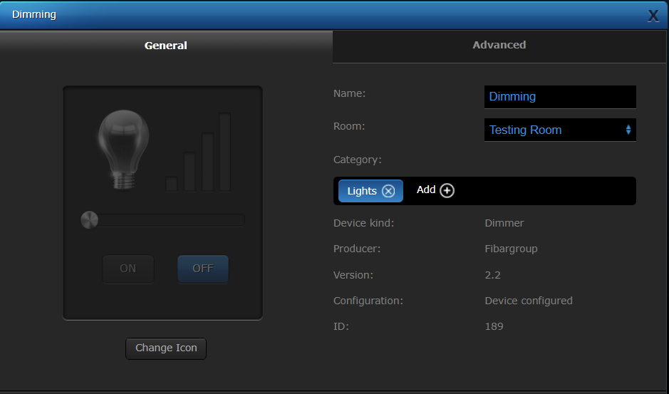

##### 
__📦Dim_Installation__

⚠️ Connect only in accordance with one of the diagrams.

⚠️ Length of wires used to connect the control switch should not exceed 20m

     1. Switch off the mains voltage.
     2. Open box and Connect with one of the diagrams below.
     3. Switch on the mains voltage and wait about 30 sec for calibration.
     4. The device will be turned off by default, then add device to network.

  
  
  
  
  

###### __Dim_Adding to the network__

     1. Place the Dimmer 2 within the direct range of your Z-Wave controller.
     2. Identify switch no. 1 (turns the light on).
     3. log in HC and add device.
     4. Quickly, three times press switch no. 1 or the B-button and wait for adding process.

Adding in security mode must be performed up to 2 meters from the controller.

For toggle switches in default configuration perform six position changes.

###### __Dim_Calibration__

     The procedure of learning the light source type is called calibration.

⚠️ During the calibration procedure, radio connection is disabled and the Dimmer 2 does not respond to any commands. It may cause temporary problems with communication in the Z-Wave network. After completing the calibration, communication with the module will be restored.

Calibration procedure is performed always after removing the device from the Z-Wave network. If the device is not included, after each power on/off calibration will occur. 

⚠️ Some types of LED and CF lamps are designed to operate in leading edge mode (with conventional dimmers). Information about proper operation mode of the bulb should be included in its manual.

⚠️ After changing the load launch the calibration or remove and add the device. Before changing the operating mode or performing the calibration procedure the light must be turned off. 

     Calibration may be forced:
          - by setting parameter 13 to 1 or 2 (without/with FIBARO Bypass 2).
          - hrough triple clicking and holding the main light switch (each hold for more than 5 seconds).
          - by selecting the appropriate MENU option using the B-button.

###### __🔄Dim_Resetting Dimmer 2__

     1. Disconnect power and remove dimmer from wall box.
     2. Connect power and locate button on the housing.
     3. Press and hold the B-button to enter the menu mode and wait to turn yellow.
     4. Quickly release and click the B-button again and after few seconds it will be started.

###### __Dim_Software update__

     - slow blinking –> transferring data
     - fast blinking –> copying data 

###### __Dim_Error Modes__

     Pressing any of the connected switches or changing state of the device using the controller will exit error mode.

     Error messages:
      
     - OVERTEMPERATURE ERROR -> the gateway receives an information about exceeding maximum temperature of the module.

     - LOAD ERROR -> Dimmer 2 will detect the change of load at the moment of power variation compared to standard power consumption (measured during the calibration).

     - SURGE ERROR -> result of electrical surges, incorrect load control.

     - OVERCURRENT ERROR -> result of rapid powering on the load. It may also occur if the soft-start functionality is disabled or as a result of the short circuit.

     - OVERLOAD ERROR ->  result of connecting receivers with too much power consumption. 

     - VOLTAGE DROP ERROR -> result of mains voltage drop or a too high brightness level of the light source.

     - HARDWARE FAIL ERROR ->  result of serious hardware failure of the Dimmer 2 or result of enabling the Dimmer 2 without load connected to the output in 3-wire connection.

###### __🔧Dim_Configuration__

###### __Dim_Associations__

     1st Association Group „Lifeline” ->can handle only one device.
     2nd Association Group „On/Off (S1)” ->assigned to switch no. 1. Sends BASIC command class.
     3rd Association Group „Dimmer (S1)” ->assigned to switch no. 1. Sends MULTILEVEL SWITCH command class frame.
     4th Association Group „On/Off (S2)” ->assigned to switch no. 2. Sends BASIC command class frame
     5th Association Group „Dimmer (S2)” ->assigned to switch no. 2. Sends MULTILEVEL SWITCH command class frame.

###### __📊 Dim_Advanced Prameters__ 🚨 

     1. Minimum brightness level -> is set automatically during the calibration process, but can be changed manually after the calibration.
          -⚠️The maximum brightness level (parameter 2) must be greater than the minimum brightness level (parameter 1).
          

     2. Maximum brightness level -> is set automatically during the calibration process, but can be changed manually after the calibration.

     10. Timer functionality (auto - off):
          - 0 – Function disabled
          - 1-32767 – time to turn off measured in seconds (1s-9.1h)
          - Default setting: 0

     13. Force auto-calibration ->Changing value of this parameter will force the calibration process.
          - 0 –> readout
          - 1 –> force auto-calibration of the load without FIBARO Bypass 2
          - 2 –> force auto-calibration of the load with FIBARO Bypass 2
          - Default setting: 0

     20. Switch type ->Choose between momentary, toggle and roller blind switch.
          - 0 –> momentary switch
          - 1 –> toggle switch
          - 2 –> roller blind switch – two switches operate the Dimmer 2 (S1 to brighten, S2 to dim)
          - Default setting: 0

      28. Scene activation functionality ->SCENE ID depends on the switch type configurations.
           - 0 –> functionality deactivated
           - 1 –> functionality activated
           - Default setting: 0

      32. On/Off mode -> This mode is necessary while connecting non-dimmable light sources. 
           - 0 –> on/off mode disabled (dimming is possible)
           - 1 –> on/off mode enabled (dimming is not possible)
           - 2 –> mode selected automatically
           - Default setting: 2

     35. Auto-calibration after power on -> This parameter determines the trigger of auto-calibration procedure, e.g. power on, load error, etc.
          - 0 –> No auto-calibration of the load after power on
          - 1 –> Auto-calibration performed after first power on
          - 2 –> Auto-calibration performed after each power on
          - 3 –> Auto-calibration performed after first power on or after each LOAD ERROR alarm.
          - Default setting: 1

     39. Power limit - OVERLOAD -> Reaching the defined value will result in turning off the load. Additional apparent power limit of 350VA is active by default.
         - 0 –> functionality disabled
         - 1-350 – 1-350W
         - Default setting: 250

     44. Time of alarm state:
          - Available settings: 1-32767 (1-32767 seconds)
          - Default setting: 600 (600s)

###### __Dim_Troubleshooting__ ⚠️⚠️

     1.  Lights are blinking after connecting FIBARO Dimmer 2.
          -> Check the type of light connected to your FIBARO Dimmer 2.

     2. Can not set fibaro dimmer 0-100%
          -> Change parameters of the device.

     3. Light turns off after short period.
          -> Change the advanced parameter.

     4. It turns on and off automatically. Surge Error occurs.
          -> Reducing the sensitivity to movement.
          -> Reconfigure the device.

      

           
           
           

     

     

      

     

      
  

  

   
  
    
   

   

   
     
    
   
    
    

 
     

